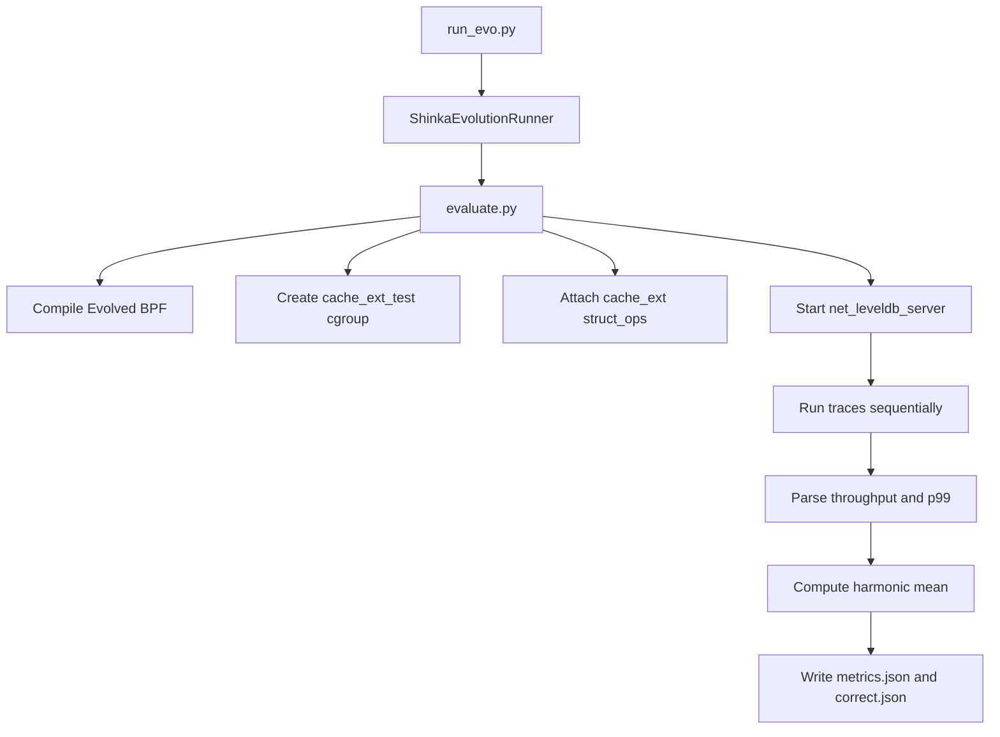

- dual-client traces in `traces/`
- file traces in `file_results/file_traces/`
- exposed cross-subsystem metrics and why they exist
- data movement over network vs local file IO
- what uses page cache and why
- post-trace metrics and combined score computation
- how the evolution loop prompts the LLM and carries generation context forward

## 1) System Architecture and Runtime Roles

At a high level, this setup evolves an eBPF cache eviction policy attached to Linux `cache_ext` struct_ops.

Core components:

- **Policy under evolution**: eBPF program generated from evolved C (compiled and loaded by `evaluate.py`)
- **Fixed userspace loader**: `cache_ext_evolved.c` loads BPF skeleton and attaches struct_ops + kprobes
- **Server workload path (network traces)**: `net_leveldb_server` serves requests over TCP; its IO goes through Linux page cache
- **Client workload path (network traces)**: `run_net_leveldb` clients (My-YCSB binary) generate read/update/rmw workloads
- **File workload path (file traces)**: `file_workload` processes do open/read/CRC/close loops directly on files
- **Evaluator**: `evaluate.py` orchestrates compile -> attach policy -> run traces -> parse metrics -> compute score
- **Evolution driver**: `run_evo.py` starts ShinkaEvolve, which repeatedly proposes patches and calls evaluator

Key runtime fact: the tested page cache policy is attached to a **memory-limited cgroup** (`cache_ext_test`, 512 MiB), so eviction pressure is intentional.

---

## 2) Execution Pipeline (Per Evaluation)

Primary path in `evaluate.py`:

1. Reset/drop caches and ensure DB state (`/mydata/leveldb_temp`)
2. Compile evolved BPF policy (`clang-14` -> `.bpf.o` -> skeleton -> userspace loader)
3. Disable MGLRU so cache decisions flow through cache_ext policy hook
4. Create test cgroup (`/sys/fs/cgroup/cache_ext_test`) with 512 MiB limit
5. Start evolved policy loader (`cache_ext_evolved.out`) and attach struct_ops + probes
6. Start `net_leveldb_server` in cgroup on port 9100
7. Run trace list in `TRACE_CONFIGS` sequentially (currently dual traces)
8. Parse per-trace metrics and compute combined harmonic score
9. Write `metrics.json` + `correct.json`
10. Cleanup (server/policy/cgroup, restore MGLRU)

Mermaid overview:

---

## 3) What Uses Page Cache (and Why)

## Network traces (`traces/*.yaml`)

- **Server (`net_leveldb_server`) is the page-cache-critical process.**
  - It opens/serves LevelDB data files under `/mydata/leveldb_temp`
  - Block cache is disabled in this setup, so reads hit Linux page cache directly
  - Server is in memory-limited cgroup, so its file-backed cache is under eviction pressure

- **Clients (`run_net_leveldb`) are request generators.**
  - They primarily create network traffic and protocol requests
  - They do not host the LevelDB dataset page cache
  - Their own process/code pages exist, but they are not the target cache working set

## File traces (`file_results/file_traces/*.yaml`)

- **Reader processes (`file_workload`) are the page-cache-critical processes.**
  - They repeatedly open and read files in `/mydata/file_workload_data/small` and `/large`
  - This directly exercises filesystem page cache for those file pages
  - Cgroup memory pressure forces eviction choices among competing readers

In both cases, the policy optimizes *which file-backed folios stay resident* when memory is constrained.

## 4) Dual-Client Traces in `traces/` (Current Active Set)

Current dual traces are defined in:

- `traces/dual_small_vs_large.yaml`
- `traces/dual_congested.yaml`
- `traces/dual_mixed_keys.yaml` (defined but not currently in default `TRACE_CONFIGS`)

Each trace is `type: dual_client`, meaning two clients run concurrently against the same server/database target.

Page-cache/cgroup size for dual traces:

- The server process (which owns the LevelDB file-backed page cache) runs in `cache_ext_test` with memory limit `512 MiB`.
- That `512 MiB` is the effective page-cache budget your evolved policy manages during dual-client evaluation.

### 4.1 `dual_small_vs_large.yaml`

Intent:

- Create asymmetric contention between:
  - a read-heavy small-value client (`reader_fast`)
  - a mixed read/update large-value client (`writer_slow`)

Configured stress dimensions:

- Both clients run on `krisub@node1` and connect to server `10.10.1.1:9100`
- `reader_fast`:
  - `value_size: 200`
  - read-only (`read: 1.0`)
  - `zipfian` (hot-set skew)
- `writer_slow`:
  - `value_size: 4096`
  - mixed read/update (`0.5/0.5`)
  - `uniform` key distribution

What it tests:

- Whether policy can protect a hot read working set while large random updates create churn
- Whether eviction decisions avoid overprotecting bulky/low-reuse pages

### 4.2 `dual_congested.yaml`

Intent:

- Stress policy under two concurrent mixed clients where both are remote and both use zipfian distributions, but with different op mixes

Configured stress dimensions:

- `wan_reader`: mostly read (`0.95 read`, `0.05 update`), smaller values
- `wan_writer`: `0.5 read`, `0.5 read_modify_write`, medium values
- Both from node1 to node0 server

What it tests:

- Policy robustness when both tenants are active and network-facing
- Handling mixed update/RMW pressure while preserving read latency-sensitive pages

### 4.3 `dual_mixed_keys.yaml`

Intent:

- Create disjoint keyspace/shape competition using different key sizes and value sizes

Configured stress dimensions:

- `standard_reader`:
  - `key_size: 16`, small values, read-only zipfian
- `largekey_mixed`:
  - `key_size: 32`, larger values, mixed read/update uniform
  - note: requires extra key prepopulation (per trace comment)

What it tests:

- Whether policy generalizes across heterogeneous key/value encodings and access locality types

---

## 5) File Traces in `file_results/file_traces/`

Trace files:

- `file_results/file_traces/file_priority.yaml`
- `file_results/file_traces/file_niceness.yaml`

### 5.0 File dataset setup (what exists on disk)

Dataset is prepared by `populate_file_workload.sh` under:

- `/mydata/file_workload_data/small`
  - `20000` files, each `4096` bytes (4 KB)
  - file names: `data_000000` ... `data_019999`
  - total about `80 MB`
- `/mydata/file_workload_data/large`
  - `5000` files, each `262144` bytes (256 KB)
  - file names: `data_000000` ... `data_004999`
  - total about `1.25 GB`

Combined working set is about `1.33 GB`, intentionally larger than the `512 MiB` cgroup memory limit used for file-policy evaluation, so page-cache eviction is unavoidable.

Workload binary behavior (`file_workload.cpp`):

- Multiple threads per process
- Open file -> read bytes -> compute CRC32 -> close
- Supports `zipfian`, `uniform`, `sequential`
- File path format per operation: `<directory>/<file_prefix>%06d` (for this setup: `data_000000` style names)
- Emits parseable line: total throughput, avg read latency, p99 read latency

Per-read IO path:

- One operation reads the entire selected file (not a tiny sampled chunk), then closes it.
- Therefore `small` readers repeatedly touch many 4 KB objects, while `large` readers stream full 256 KB objects, creating very different refill and cache-footprint pressure.

### 5.1 `file_priority.yaml`

Intent:

- Priority-asymmetric competition

Setup:

- Cgroup/page-cache budget: both reader processes run in the same memory-limited cgroup with `512 MiB` limit.
- Process A (`high_prio_reader`):
  - directory: `/mydata/file_workload_data/small`
  - file set: `data_000000` ... `data_019999` (`num_files: 20000`, prefix `data_`)
  - selection: `zipfian` (`zipfian_constant: 0.99`), so a hot subset is hit disproportionately
  - scheduling/workload: `nice=-10`, `3` threads, `10s` warmup + `120s` measurement
- Process B (`low_prio_reader`):
  - directory: `/mydata/file_workload_data/large`
  - file set: `data_000000` ... `data_004999` (`num_files: 5000`, prefix `data_`)
  - selection: `uniform`, so accesses are spread across the full large-file set
  - scheduling/workload: `nice=10`, `2` threads, `10s` warmup + `120s` measurement

What it tests:

- Whether policy uses scheduler-derived priority context to favor high-priority process working set under pressure

### 5.2 `file_niceness.yaml`

Intent:

- Dynamic priority adaptation during a single run

Setup:

- Cgroup/page-cache budget: both reader processes run in the same memory-limited cgroup with `512 MiB` limit.
- Two processes with `nice_schedule` swaps at 60s
  - A: `-15 -> 15`
  - B: `15 -> -15`
- Reader A (`reader_alpha`) reads `/mydata/file_workload_data/small`
  - file set: `data_000000` ... `data_019999` (`num_files: 20000`)
  - selection: `zipfian` hot-set access (`zipfian_constant: 0.99`)
  - threads/timing: `2` threads, `10s` warmup, `120s` runtime
- Reader B (`reader_beta`) reads `/mydata/file_workload_data/large`
  - file set: `data_000000` ... `data_004999` (`num_files: 5000`)
  - selection: `uniform` spread
  - threads/timing: `2` threads, `10s` warmup, `120s` runtime

What it tests:

- Whether policy adapts when "important" process changes mid-run
- Whether stale priority assumptions are corrected by live scheduler observations

---

## 6) Cross-Subsystem Metrics Exposed to Policies (and Why)

Two initial policy templates define the observability surface:

- `initial.c` (network-aware)
- `file_initial.c` (scheduler-aware)

They both have the same architecture pattern:

- **Fixed infrastructure** outside `EVOLVE-BLOCK`
  - map declarations
  - kprobe metric collection path
  - struct_ops registration
- **Evolved region** inside `EVOLVE-BLOCK`
  - constants, callbacks, helper logic mutated by LLM

### 6.1 Network/TCP metrics (`initial.c`)

Collected in fixed kprobe `tcp_recvmsg` path, e.g.:

- Timing/cadence: `last_packet_ts`, `net_prev_packet_ts`, `net_recv_count`
- RTT/jitter: `net_srtt_us`, `net_mdev_us`
- Throughput counters: `net_bytes_received`, `net_bytes_acked`, `net_segs_in`, `net_segs_out`, `net_delivered`
- Congestion/flow control: `net_snd_cwnd`, `net_snd_ssthresh`, `net_rcv_wnd`, `net_packets_out`
- Loss/retrans: `net_total_retrans`, `net_retrans_out`, `net_lost`

Why exposed:

- Cache misses are more expensive under poor network conditions
- Policy can increase protection when congestion/loss/RTT rise
- Policy can detect bursts and preserve short-term working set

### 6.2 Scheduler/CPU metrics (`file_initial.c`)

Collected in fixed kprobe `vfs_read` path on watched files:

- Timing/cadence: `sched_last_read_ts`, `sched_prev_read_ts`, `sched_read_count`
- Priority: `sched_nice`, `sched_prio`, `sched_static_prio`
- CPU runtime/load: `sched_vruntime`, `sched_sum_exec_runtime`, `sched_nr_migrations`, `sched_nr_running`, `sched_cfs_load`
- Process identity: `sched_pid`, `sched_tgid`, `sched_on_cpu`

Why exposed:

- Policy can prioritize folios used by higher-priority tasks
- Policy can adapt when niceness changes dynamically
- Policy can become contention-aware under heavy runqueue load

### 6.3 Per-folio metadata (both templates)

Used to connect system-level signals to eviction decisions per page/folio:

- Common fields: last access time, access count
- Network template adds access tier concept
- File template binds folio to last accessor priority/PID

Why exposed:

- Lets policy score "keep vs evict" using both recency/frequency and subsystem context (network state or scheduler state)

---

## 7) Data Transfer and IO Paths

## Dual-client network traces

What is transferred:

- My-YCSB client requests over TCP to `net_leveldb_server` on port 9100
- Request payload includes operation type and key/value payloads (for updates/inserts/rmw)
- Read responses transfer value bytes back to clients

How transferred:

- Standard TCP socket path (`run_net_leveldb` client <-> `net_leveldb_server`)
- In current dual trace configs, both clients run on node1 and talk to node0 over network
- Optional delay proxy mechanism exists in runner code, but active trace YAMLs do not currently set local proxy parameters

## File traces

- No application-level network transfer required for workload semantics
- Data movement is local filesystem read path: process -> VFS -> page cache -> storage backing on miss

---

## 8) Metrics Collected After Traces

From evaluator (`evaluate.py`) and dual runner (`run_dual_trace.py`):

Per dual trace, collected/derived:

- `total_throughput` (ops/sec)
- `read_latency_p99_ns`
- (in dual runner internals) per-client throughputs before aggregation

Dual aggregation rule:

- `total_throughput = sum(client_i.total_throughput)`
- `read_latency_p99_ns = max(client_i.read_p99_ns)`

Public metric fields written in `metrics.json` include:

- `<trace_name>_throughput`
- `<trace_name>_read_p99_ns`
- `combined_score_harmonic_mean`
- `traces_passed`
- `traces_total`

Private metric fields include per-trace detail objects and error info when present.

---

## 9) Combined Score Calculation

Evaluator computes harmonic-mean-based score across configured traces:

If all traces nonzero:

- `HM = n / sum(1 / tp_i)`

If only some traces nonzero:

- `HM_partial = k / sum(1 / tp_i for nonzero)`
- `combined = HM_partial * (k / n)`

If none nonzero:

- `combined = 0`

Where:

- `n` = total trace count
- `k` = traces with throughput > 0

Why harmonic mean:

- Strongly penalizes policies that are good on one trace but poor/failing on another
- Encourages robust, cross-trace behavior rather than single-trace overfitting

---

## 10) Evolution Loop: How the LLM Is Prompted and What Context It Gets

High-level flow:

- `run_evo.py` loads YAML config and starts `EvolutionRunner`
- Runner repeatedly proposes code changes, evaluates them, stores artifacts, updates archive/selection state

### 10.1 Input config and evaluator binding

From config (`shinka_evict.yaml` / `shinka_file_evict.yaml`):

- `evo_config` -> model choices, temperatures, patch modes, generation counts
- `db_config` -> archive/island/selection strategy
- `eval_program_path` (default `evaluate.py`, overridden for file workflow)
- `task_sys_msg` -> domain-specific optimization instructions
- `init_program_path` -> initial policy template (`initial.c` or `file_initial.c`)

### 10.2 Prompt composition

Prompt has two major pieces:

- **System message**
  - `task_sys_msg` from YAML (architecture, metrics, constraints, objective)
  - plus patch-format instructions (diff/full/fix formats)

- **User message**
  - current parent program code
  - current and prior program metric summaries
  - selected "inspiration" programs from archive/top-k pool
  - optional meta recommendations

This means next-generation proposals are conditioned on both code and performance history.

### 10.3 What is passed from previous generations

Carried context includes (via DB + artifact selection):

- parent program lineage
- sampled archive inspirations
- top-k inspirations
- prior metrics and summaries
- meta recommendations generated from recent history

Practical evidence appears in run artifacts such as:

- `results/eviction_evo/meta_memory.json`
- `results/eviction_evo/gen_*/attempts/.../llm_response.txt`
- `results/eviction_evo/gen_*/attempts/.../patch.txt`

### 10.4 Initial policy file setup for LLM

Initial templates (`initial.c`, `file_initial.c`) are intentionally structured for safe mutation:

- Fixed code around probes/maps/registration remains stable
- Evolved region is delimited by `EVOLVE-BLOCK-START` / `EVOLVE-BLOCK-END`
- Comments enumerate available APIs, metrics, and constraints

This gives LLM a constrained, semantically rich surface for edits while preserving loader/probe plumbing.

---

## 11) Artifact Layout (What You Can Inspect Per Generation)

Under results dir (e.g., `results/eviction_evo/`), each generation typically has:

- `gen_<n>/original.c` (parent/input code)
- `gen_<n>/main.c` (candidate/evolved code)
- `gen_<n>/edit.diff` and/or `search_replace.txt`
- `gen_<n>/results/metrics.json`
- `gen_<n>/results/correct.json`
- `gen_<n>/attempts/novelty_*/resample_*/patch_*/`
  - `llm_response.txt`
  - `patch.txt`
  - `metadata.json`

These artifacts show exactly what was proposed, how it was applied, and how it evaluated.

---

## 12) Clarifications for Current Repository State

- The active dual-trace evaluator path currently points to `traces/` in `evaluate.py`.
- File trace definitions exist in `file_results/file_traces/` and are fully specified there.
- `shinka_file_evict.yaml` references `eval_program_path: file_evaluate.py`; in this repository snapshot, detailed file-evaluator code is not in `eviction_evo/`, but its behavior and metric shape are evident from config and recorded result artifacts.

---

## 13) Quick Mental Model

- **Network mode**: optimize server-side page cache under remote dual-client TCP load.
- **File mode**: optimize shared page cache under competing local readers with scheduler priority asymmetry.
- **Evolution objective**: maximize harmonic mean throughput across configured traces, with trace failure strongly penalized.
- **LLM loop**: mutate only policy logic region, evaluate, feed back structured history, repeat.

---

## 14) Results Comparison Appendix (Now Included)

This section compares concrete metrics and policy/code differences for:

- file traces: `gen_0` vs `best` in `file_results/results/file_eviction_evo`
- dual-client traces: baseline run `baseline_20260311_101837` vs evolved `best` in `results/eviction_evo/best`

### 14.1 File Traces: `gen_0` vs `best`

Data source:

- `file_results/results/file_eviction_evo/gen_0/results/metrics.json`
- `file_results/results/file_eviction_evo/best/results/metrics.json`
- `file_results/results/file_eviction_evo/gen_0/main.c`
- `file_results/results/file_eviction_evo/best/main.c`

#### Metric comparison

- **Combined score (harmonic mean)**
  - gen_0: `2480.1752`
  - best: `2911.5110`
  - change: `+431.3358` (`+17.39%`)

- **file_priority_throughput**
  - gen_0: `2703.39`
  - best: `3496.15`
  - change: `+792.76` (`+29.32%`)

- **file_niceness_throughput**
  - gen_0: `2291.01`
  - best: `2494.39`
  - change: `+203.38` (`+8.88%`)

- **file_priority_read_p99_ns**
  - gen_0: `67,969,464`
  - best: `66,937,330`
  - change: `-1.52%` (slightly better tail latency)

- **file_niceness_read_p99_ns**
  - gen_0: `58,748,217`
  - best: `73,324,382`
  - change: `+24.81%` (worse tail latency)

#### Code-level comparison and why this likely happened

`gen_0` policy characteristics (single-list, simpler protection):

- one `main_list`
- single threshold (`HOT_ACCESS_THRESHOLD=3`)
- broad recency/working-set windows (`100ms`, `1s`)
- mostly binary keep/evict checks based on `recently_used`, `is_hot`, and high-priority hints

`best` policy characteristics (dual-list, stronger scheduling-aware segregation):

- two explicit lists:
  - `high_prio_list`
  - `low_prio_list`
- stronger admission/routing by `accessor_nice <= -5`
- dedicated eviction callbacks per list (`bpf_evict_high_prio_cb`, `bpf_evict_low_prio_cb`)
- demotion logic from high-priority list for single-access aged pages
- smaller windows (`30ms`, `300ms`) for faster adaptation
- more aggressive low-priority eviction and stronger high-priority retention

Why throughput improved:

- Dual-list segregation reduces destructive interference between high- and low-priority working sets.
- Faster windows + demotion prevent one-touch pages from occupying protected slots.
- High-priority reads get more reliable cache residency, which matches `file_priority` objective.

Why one p99 got worse while throughput improved:

- The best policy is tuned to maximize harmonic-mean throughput, not to minimize every latency tail.
- More aggressive low-priority eviction can increase tail misses for some intervals in the niceness-swap trace, even while aggregate ops/sec goes up.

### 14.2 Dual Traces: Baseline (`baseline_20260311_142842`) vs Evolved `best`

Data source:

- baseline:
  - `baseline_results/summary.txt`
  - `baseline_results/baseline_20260311_142842/dual_small_vs_large.log`
  - `baseline_results/baseline_20260311_142842/dual_congested.log`
- evolved:
  - `results/eviction_evo/best/results/metrics.json`
  - `results/eviction_evo/best/main.c`
- baseline execution mode proof:
  - `run_baseline.sh` (`no BPF policy`, server started directly in cgroup)

#### Metric comparison

Baseline values (from `summary.txt`, timestamp `20260311_142842`):

- combined score: `1531.3933`
- dual_small_vs_large: `1098.04`
- dual_congested: `2529.81`

Evolved best values:

- combined score: `2182.2679`
- dual_small_vs_large: `1681.15`
- dual_congested: `3109.00`

Changes (best vs new baseline):

- **combined score**: `+650.8746` (`+42.50%`)
- **dual_small_vs_large throughput**: `+583.11` (`+53.10%`)
- **dual_congested throughput**: `+579.19` (`+22.89%`)

Tail-latency context from new baseline logs:

- baseline `dual_small_vs_large` read p99: `69,926,792 ns`
- baseline `dual_congested` read p99: `51,989,803 ns`

Best policy p99 from metrics:

- best `dual_small_vs_large` read p99: `58,230,507 ns`
- best `dual_congested` read p99: `42,551,499 ns`

In this updated comparison, evolved best is better on both throughput and p99.

Baseline code behavior:

- No evolved BPF policy is attached in `run_baseline.sh`.
- Kernel reclaim behavior is baseline MGLRU path under the same cgroup pressure.

Best evolved policy (`results/eviction_evo/best/main.c`) behavior:

- single-list network-aware policy
- adaptive recency/working-set windows (`BASE_RECENT_NS`, `BASE_WORKING_SET_NS`) scaled by network signals
- dynamic hot threshold (`2/3/4`) based on session activity and pressure
- pressure detection via loss, cwnd pressure, jitter, receive-window pressure

Why evolved best now outperforms baseline:

- The evolved policy is explicitly tuned for this dual-trace objective (harmonic mean across both traces), while baseline reclaim is generic.
- Adaptive protection of hot/recent folios under active sessions likely reduces avoidable refaults in both traces.
- Dynamic thresholding appears to preserve throughput under mixed read/update and RMW pressure better than the new baseline run.
